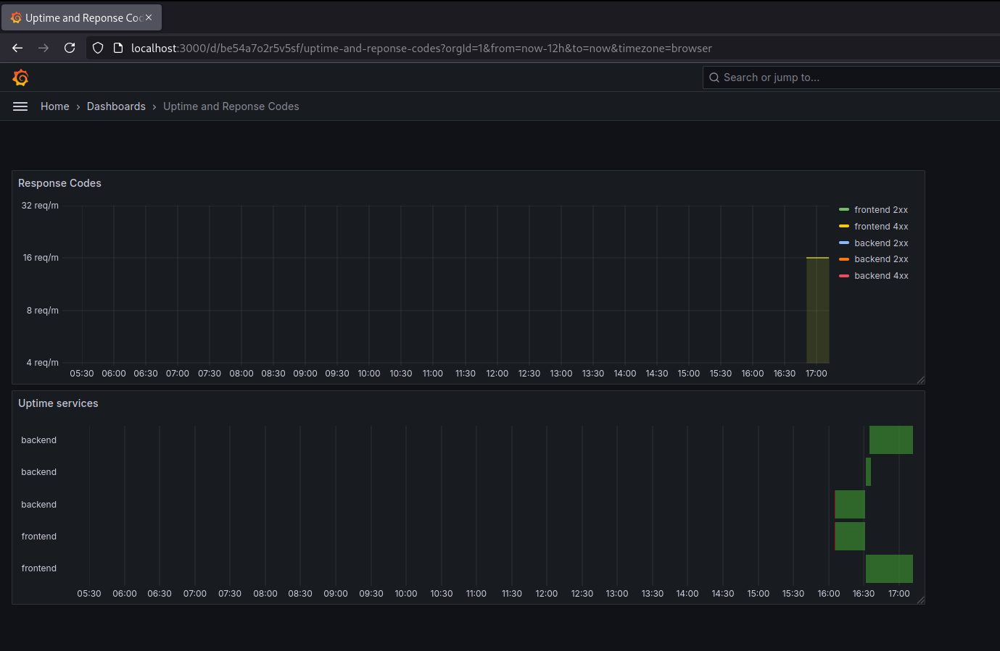
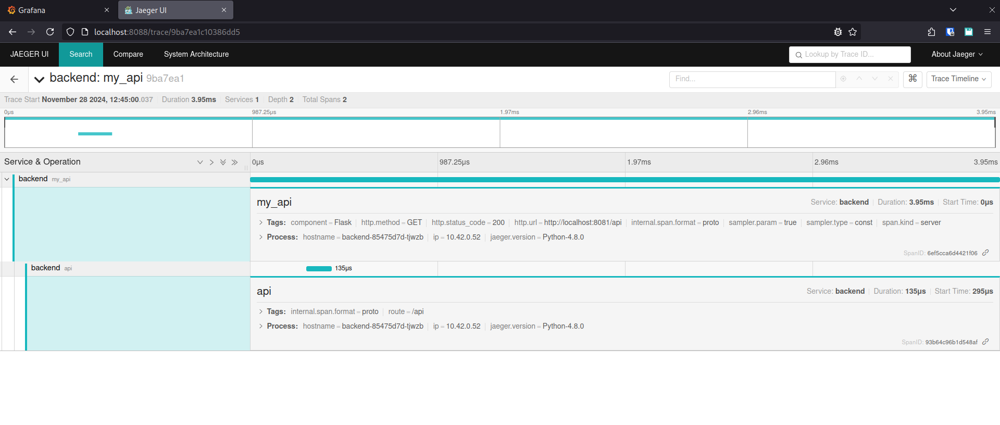
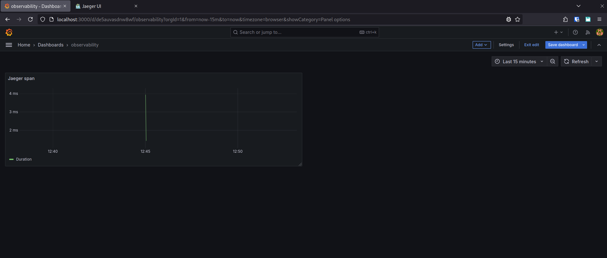
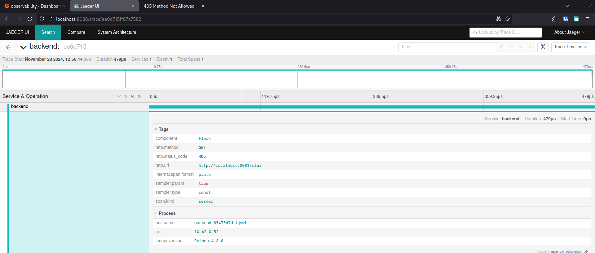

**Note:** For the screenshots, you can store all of your answer images in the `answer-img` directory.

## Verify the monitoring installation

run `kubectl` command to show the running pods and services for all components. Take a screenshot of the output and include it here to verify the installation

### Monitoring

### Observability

## Setup the Jaeger and Prometheus source
Expose Grafana to the internet and then setup Prometheus as a data source. Provide a screenshot of the home page after logging into Grafana.

## Create a Basic Dashboard
Create a dashboard in Grafana that shows Prometheus as a source. Take a screenshot and include it here.

## Describe SLO/SLI
Describe, in your own words, what the SLIs are, based on an SLO of *monthly uptime* and *request response time*.

Service Level Indicators (SLIs) are specific metrics used to measure the performance of a service.

For an SLO of *monthly uptime*, an SLI could be the percentage of time the service is available over a month.

For *request response time*, an SLI could be the average, min or max of the response time for requests made to the service.

## Creating SLI metrics.
It is important to know why we want to measure certain metrics for our customer.
Describe in detail 5 metrics to measure these SLIs. 
- **Resource Utilization**: The percentage of CPU, memory, and other resources used by the service.
- **Uptime Percentage**: The percentage of time the service is available over a month.
- **Average Response Time**: The average time taken to respond to requests.
- **Error Rate**: The percentage of requests that result in errors (4xx and 5xx status codes).
- **Latency**: The time taken for a request to travel from the client to the server and back.

## Create a Dashboard to measure our SLIs
Create a dashboard to measure the uptime of the frontend and backend services
We will also want to measure to measure 40x and 50x errors. 
Create a dashboard that show these values over a 24 hour period and take a screenshot.
*NOTE*: Added for 12 hours,for 24 it would be hard to see the data.

## Tracing our Flask App
We will create a Jaeger span to measure the processes on the backend.
Once you fill in the span, provide a screenshot of it here.
Also provide a (screenshot) sample Python file containing a trace and span code used to perform Jaeger traces on the backend service.

## Jaeger in Dashboards
Now that the trace is running, let's add the metric to our current Grafana dashboard.
Once this is completed, provide a screenshot of it here.

## Report Error
Using the template below, write a trouble ticket for the developers,
to explain the errors that you are seeing (400, 500, latency) and to let them know the file that is 
causing the issue also include a screenshot of the tracer span to demonstrate how we can user a tracer to locate errors easily.

TROUBLE TICKET

Name: Theodor Manolescu

Date: 28/11/2024

Subject: can't access the service

Affected Area: Backend Service, /star endpoint

Severity: High

Description:
The request made to the /star endpoint is returning a 405 not allowed error.
This is causing the service to be unavailable.
The error is likely due to a misconfiguration in the backend service.

## Creating SLIs and SLOs
We want to create an SLO guaranteeing that our application has a 99.95% uptime per month. 
Name four SLIs that you would use to measure the success of this SLO.
- **Uptime Percentage**: The percentage of time the service is available over a month.
- **Error Rate**: The percentage of requests that result in errors (4xx and 5xx status codes).
- **Latency**: The time taken for a request to travel from the client to the server and back.
- **Resource Utilization**: The percentage of CPU, memory, and other resources used by the service.

## Building KPIs for our plan
Now that we have our SLIs and SLOs, create a list of 2-3 KPIs to accurately measure these metrics as well as a description of why those KPIs were chosen. We will make a dashboard for this, but first write them down here.
- service uptime of at least 99.95% per month
- error rate of less than 0.05%
- resource utilization of less than 80%

## Final Dashboard
Create a Dashboard containing graphs that capture all the metrics of your KPIs and adequately representing your SLIs and SLOs. 
Include a screenshot of the dashboard here, and write a text description of what graphs are represented in the dashboard.  

Uptime
    - shows the uptime of the services over the last 3 hours.
Errors frontend and backend 
    - shows the number or req/min of the frontend and backend services over the last 3 hours.
    - it filters for 4xx and 5xx errors.   
CPU Usage
    - shows the CPU usage of the services over the last 3 hours.
Memory Usage
    - shows the memory usage of the services over the last 3 hours.